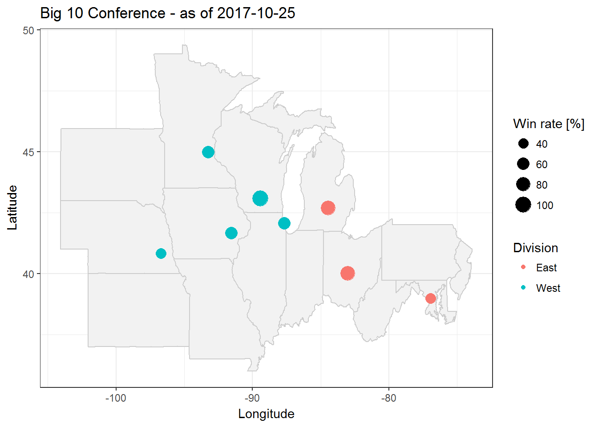
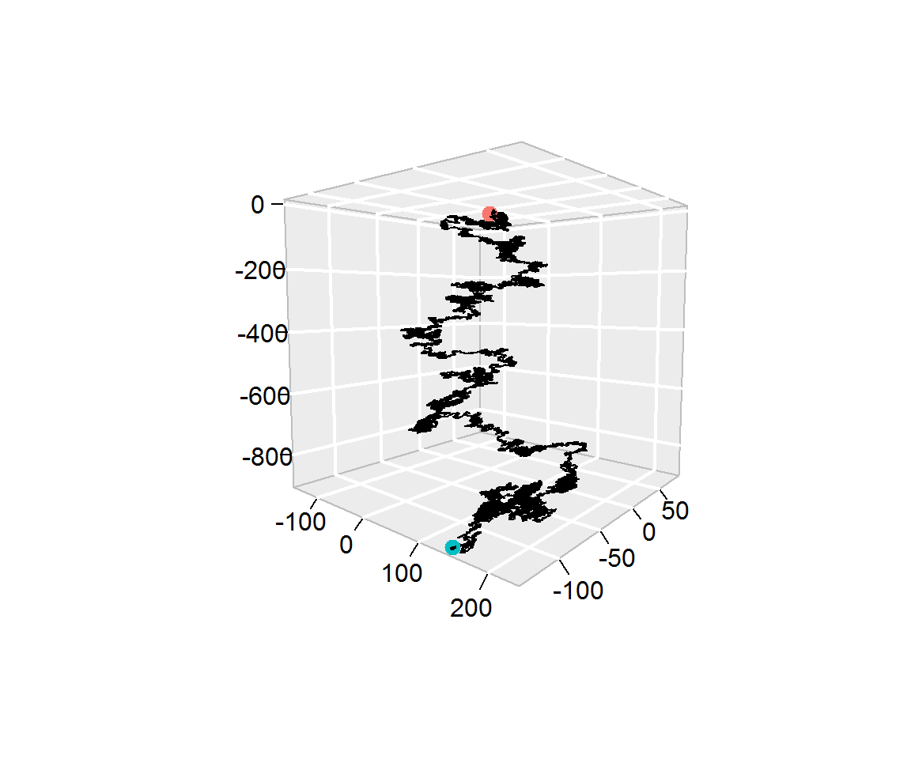
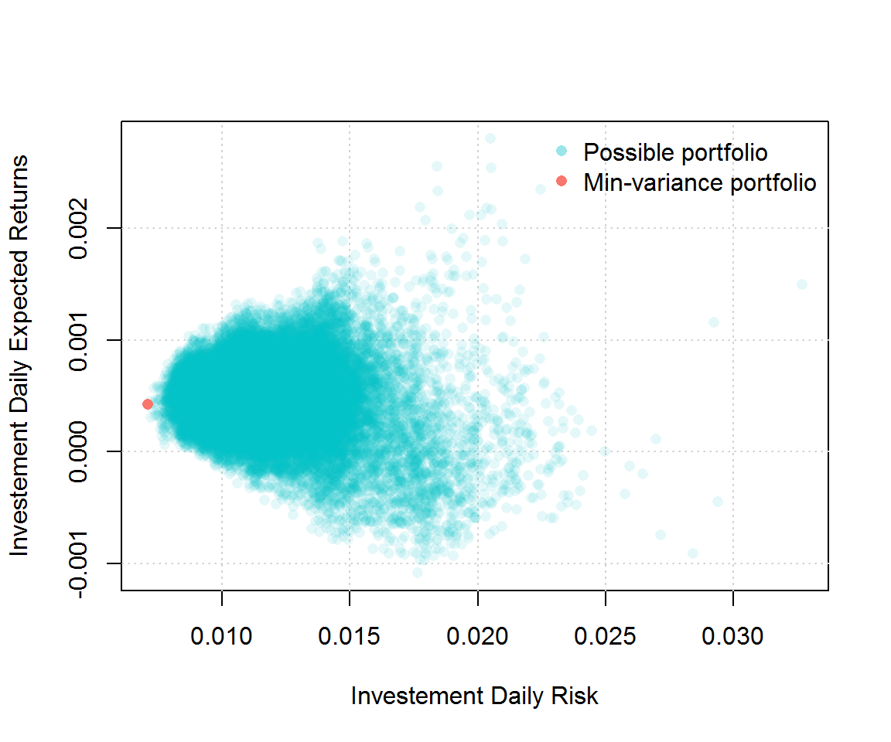

# Homework 1


<div class="alert alert-info">
  <strong>Important:</strong> To submit your homework share your GitHub repository with **stephaneguerrier** and **munsheet** by the deadline (i.e. 09/14/17 at 4PM).  Do not modify your homework after the deadline. We will grade the most recent (~ 4PM) portion of your RMarkdown file. 
</div>


The objectives of this homework assignment are the following

- Build your own RMarkdown document; 
- Master different aspects of RMarkdown syntax;
- Become familiar with GitHub as collaborative tool.

To start, create a (perferably private) GitHub repository for your group, and name it **stat297hw1**. Once again, make sure to add **munsheet** and **stephaneguerrier** as collaborators. This project **must** be done using GitHub and respect the following requirements:

- All members of the group must `commit` at least once. 
- All commit messages must be reasonably `clear` and `meaningful`.   
- Your GitHub repository much include at least one `issue` containing some form of TO DO list. 

In your repository create a file called \textbf{HW1.Rmd} providing an HTML output with the theme `cerulean` and syntax highlighting `tango`. This file should contain the following elements:

1. A "title" section which should *at least* include:
    - A title (e.g. Homework 1) 
    - The authors 
    - The date (think of using `Sys.time()`)

2. A section called "Introduction" where you provide a short summary of the structure of your homework. Moreover, record a short video to introduce your group and include it in your R Markdown document.

3. A section called "Group Members". This sections should have one sub-section for each group member in your team. For example, a group with three members should have three biographies in total. Each of these sub-sections (named after each group member) should include small biographies containing *at least* the following elements:

    - A picture of your choice (preferably of yourself). Make sure to include a caption for this image. 
    -  A paragraph describing your favorite hobby as well as one interesting fact about yourself.
    - Your favorite quote in blockquote format and be sure to reference your quote using BibTex.
    - A table having two columns (first column containing the classes you are following this semester; second column containing the time of these classes).

4. A section called "R Markdown Syntax", where you will demonstrate your R Markdown skills! In this section make sure to: 

    - Show an example where the chunk option `cache = T` leads to a misleading answer. This example must be different from the one presented in the textbook.
    - Simulate 100 random samples from a standard normal distribution using the function `rnorm()`. Store these 100 values in a vector called `x`. Then, compute the empirical median, mean and variance of `x`. Are these results different from 0, 0 and 1 (their respective theoretical values)? Is this result surprising? Justify your answer. 
    - Include a graph showing the histogram of `x` (make sure to include a caption to this figure), this can be done in R using the function `hist()`.
    - Include the equation below: 
\[
	\begin{aligned}
			 \mathbb{E} \left[ \text{var} \left\{
                             \boldsymbol{v}_1\left(
                               \hat{\boldsymbol{\theta}},n\right) \big|
                             \hat{\boldsymbol{\theta}} \right\}  \right] 
&=
                         \text{var} \left\{ \mathbf{v}_1\left(
                             \boldsymbol{\theta}_0,n\right)  \right\}  +
                         \mathbb{E} \left[\mathcal{O}_p\left\{
{\bf D}_1(\boldsymbol{\theta}^*,n)(\hat{\boldsymbol{\theta}} - \boldsymbol{\theta}_{0}), 
\dots,
{\bf D}_p(\boldsymbol{\theta}^*,n)(\boldsymbol{\theta} - \boldsymbol{\theta}_{0})
\right\}\right]\\
			&= \text{var} \left\{ \mathbf{v}_1\left( \boldsymbol{\theta}_0,n\right)  \right\}  + \mathcal{O}\left(n^{-2}\right).
	\end{aligned}
\]

    - Include the following *in-line* equation: $\mathbf{A} \equiv \left[a_{i,j}\right]_{i,j = 1, \ldots, p}$.
    - Include the following text in blue\textbf{blue}: <font color="blue">"Vérité dans un temps, erreur dans un autre.", Charles de Montesquieu</font>
    - Include a "More info" button with hide/unhide functionality such as:
    <button data-toggle="collapse" data-target="#demo">More info</button>
<div id="demo" class="collapse">
Some additional info... :)
</div> 
    - Include a "color box" such as the one below:
    
    <div class="alert alert-success">
  <strong>Some important Info:</strong> something
</div>

5. A "References" section that contains all the references used in your document.

# Homework 2

<div class="alert alert-info">
  <strong>Important:</strong> To submit your homework share your GitHub repository with **stephaneguerrier** and **munsheet** by the deadline, 4PM 10/13/2017.  **Do not modify your homework after the deadline**. We will grade the version of your RMarkdown file that's closest to 4PM 10/13/2017.
</div>

The objectives of this homework assignment are the following:

- Learn how program effectively using if/else and iterations statements; 
- Become familiar with using data frame objects and mapping packages;
- Constructing a portfolio;
- Become familiar with GitHub and using it as a collaborative tool.

To start, create a (perferably private) GitHub repository for your group, and name it **stat297hw2**. Be sure to add **munsheet** and **stephaneguerrier** as collaborators. 

This project **must** be done using GitHub and respect the following requirements:

- Each member of the group must `commit` at least once. 
- All commit messages must be reasonably `clear` and `meaningful`.   
- Your GitHub repository must include at least one `issue` containing some form of a TO DO list. 

**Problem 1: Fizz Buzz** 

Write a program that prints the numbers from 1 to 1000. But for multiples of three print "Fizz" instead of the number and for the multiples of five print "Buzz". For numbers which are multiples of both three and five print "FizzBuzz".

An example output would be: 

```{r, eval = FALSE}
1, 2, Fizz, 4, Buzz, Fizz, 7, 8, Fizz, Buzz, 11, Fizz, 13, 14, Fizz Buzz, 16, 17, Fizz, 19, Buzz, Fizz, 22, 23, Fizz, Buzz, 26, Fizz, 28, 29, Fizz Buzz, 31, 32, Fizz, 34, Buzz, Fizz, ...
```


**Problem 2: Map**

Using the same tools we used in class, create a simple map to represent current standing in the Big Ten football conference. More specifically, the goal of this problem is to reproduce as closely as possible the map below:

<center>{width=50%}</center>

Note that the code below was used to download the data needed for this graph:

```{r, message=FALSE, warning=FALSE, cache=TRUE}
library(maps)
library(ggmap)
library(rvest)

# Define webpage
big10 = read_html("http://www.bigten.org/library/stats/fb-confsked.html#standings")

# Get uni names
big10 %>% 
    html_nodes(".b1gfbstats:nth-child(9) td:nth-child(1) , .b1gfbstats:nth-child(6) td:nth-child(1)") %>% 
    html_text() -> uni_name
uni_name = paste(uni_name,"University")

# Find uni locations
uni_coord = data.frame(geocode(uni_name))

# Get win rate
big10 %>% 
    html_nodes("td:nth-child(7)") %>%
    html_text() -> uni_wp
uni_coord$wp = 100*as.numeric(uni_wp[1:length(uni_name)])

# Get division
uni_coord$conf = rep(c("East Division","West Division"), each = length(uni_name)/2)
```

**Problem 3: 3D-random walks**

In this problem you will program a three-dimensional random walk. For this purpose we will consider a three-dimensional space where we let $\mathbf{X}_0 = [0 \;\; 0\;\; 0]^T$ denote the starting point of our process. Suppose that there exist a sequence of random variables $U_1, \cdots, U_B$ such $U_t \stackrel{iid}{\sim} \mathcal{U}(0,1)$. Then, we let the position at time $t$ (where $1 \leq t \leq B$) be given by

\[
\mathbf{X}_t = \mathbf{X}_{t - 1} + \mathbf{f}(U_t), 
\]

where

\[
\mathbf{f}(U_t) = \left\{
	\begin{array}{ll}
		[\phantom{-}1 \; \,\;\phantom{-}0 \; \,\;\phantom{-}0]^T  & \mbox{if } U_t \leq a_1 \\
		[     -1      \; \,\;\phantom{-}0 \; \,\;\phantom{-}0]^T  & \mbox{if } U_t \in (a_1, \, a_2] \\
		[\phantom{-}0 \; \,\;\phantom{-}1 \; \,\;\phantom{-}0]^T  & \mbox{if } U_t \in (a_2, \, a_3] \\
		[\phantom{-}0 \; -1       \; \,\;\phantom{-}0]^T  & \mbox{if } U_t \in (a_3, \, a_4] \\
		[\phantom{-}0 \; \,\;\phantom{-}0 \; \,\;\phantom{-}1]^T  & \mbox{if } U_t \in (a_4, \, a_5] \\
		[\phantom{-}0 \; \,\;\phantom{-}0 \; -1]^T  & \mbox{if } U_t > a_5. \\
	\end{array}
\right.
\]

So for example, if we consider $B = 2$, $a_i = \frac{i}{6}$, $U_1 = 0.12$ and $U_2 = 0.81$ then we have

\[\mathbf{X}_1 = \mathbf{X}_0 + \mathbf{f}(U_t = 0.12) = \left[
\begin{matrix}
0\\
0\\
0\\
\end{matrix}\right] + \left[
\begin{matrix}
1\\
0\\
0\\
\end{matrix}\right] = \left[
\begin{matrix}
1\\
0\\
0\\
\end{matrix}\right]. \]

and

\[\mathbf{X}_2 = \mathbf{X}_1 + \mathbf{f}(U_t = 0.81) = \left[
\begin{matrix}
1\\
0\\
0\\
\end{matrix}\right] + \left[
\begin{matrix}
0\\
0\\
1\\
\end{matrix}\right] = \left[
\begin{matrix}
1\\
0\\
1\\
\end{matrix}\right]. \]


- **(a)** Using the same idea, simulate a three-dimensional random walk with $B = 10^4$, $a_i = \frac{i}{6}$ and with $U_t$ being obtained as follows

```{r}
B <- 10^4
set.seed(1982)
Ut <- runif(B)
head(Ut)
```

Therefore, $U_t$ corresponds to the *t*-th element `Ut`. Using the characteristics, show that

\[
X_B = \left[\begin{matrix}
\phantom{-}26\\
          -44\\
\phantom{-}26\\
\end{matrix}\right],
\]

and provide a graphical respresentation of your random walk. For example, you can produce a graph similar to the one below which is based on the function `segments3D` from the `plot3D` package. Note that the red and blue points indicate, respectively the starting and end points of the random walk.

<center>{width=50%}</center>

- **(b)** Repeat what you have in part **(a)** but with $B = 10^5$, $a_i = 0.99 \frac{i}{6}$ and with $U_t$ being obtained as follows

```{r}
B <- 10^5
set.seed(2000)
Ut <- runif(B)
head(Ut)
```

You should obtain

\[
X_B = \left[\begin{matrix}
\phantom{-}142\\
-133\\
-899\\
\end{matrix}\right],
\]

and produce a graph similar to:

<center>{width=50%}</center>

- **(c) - bonus:** Show that using the setting of part **(b)** we have:

\[\mathbb{E} \left[ X_B \right] = \left[\begin{matrix}
0\\
0\\
-0.01 B\\
\end{matrix}\right]. \]

Does this result make sense given the end of the process simulated in part **(b)**

- **(d) - bonus** Create a video to show how a random walk changes in time (an example is provided in file "RW3D.html" posted on piazza).

Below create a video as a HTML file. More information can be shown by looking into the `animation` package. This can, however be done in a video taken in any way and is more free form. 

```{r, eval=FALSE, echo = FALSE}
htmltools::includeHTML("RW3D.html") 
```

```{r, echo = FALSE, eval = FALSE}
library(animation)
ani.options(interval=.05)
B = 500
Xt = RW3D(B = B)

saveHTML({
  for (i in 1:(B-1)) {
    Yt = Xt[,1:(i+1)]
    class(Yt) = "RW3D"
    plot(Yt)
  }
}, htmlfile = "RW3D.html")
```


**Problem 4: Construct a portfolio**

Suppose that you are working in an investment firm company as a quantitative analyst. Your boss gives you the task of creating a portfolio for one of your clients. The client wants to find the portfolio with the smallest variance that satisfies the following constraints:
  
- Invest exactly $1,000,000.
- Only invest in stocks that are in the S&P500 index.
- Spend less than $100 in execution.

Your execution fees (i.e. the cost of buying shares) are given by $C_i = \max \left(\$40, \$ 0.0001 \cdot X_i \right)$ for each transaction where $X_i$ represent the amount of money you wish to invest in stock $i$. For example, if you want to invest 30% and 70% in stocks A and B your total cost would be

\[
  \text{Cost} = C_1 + C_2 = \max \left(\$40, \$ 0.0001 \cdot 0.3 \cdot  10^6  \right) + \max \left(\$40, \$ 0.0001 \cdot 0.7 \cdot  10^6  \right) = \max(\$40, \$30) + \max(\$40, \$70) = \$40 + \$70 = \$110.
  \]

Note that $\sum_i X_i = \$1,000,000$. Therefore, your boss want you to compute all possible portfolios that satify the client's constraints, represent them graphically as (for example) in the graph below and find the weight of the best (i.e. minimum variance) portfolio. 

<center>{width=50%}</center>

To help complete this task your boss tells you to use **3 years** of historical data and gives you this code to download the data you will need:

```{r, message=FALSE, warning=FALSE, cache = TRUE}
library(quantmod)
library(rvest)
sp500 <- read_html("https://en.wikipedia.org/wiki/List_of_S%26P_500_companies")

sp500 %>% 
html_nodes(".text") %>% 
html_text() -> ticker_sp500

SP500_symbol <- ticker_sp500[(1:499)*2+1]
SP500_symbol[SP500_symbol == "BRK.B"] <- "BRK-B"
SP500_symbol[SP500_symbol == "BF.B"] <- "BF-B"
```

He also mentioned that the function `get()` could be useful for this project and provides you with the example below: 

```{r, message=FALSE, warning=FALSE, cache = TRUE}
library(quantmod)
today <- Sys.Date()
three_year_ago <- seq(today, length = 2, by = "-3 year")[2]
stocks_tickers <- c("AAPL", "MSFT")
getSymbols(stocks_tickers, from = three_year_ago, to = today)
nb_ticker <- length(stocks_tickers)
var_stocks <- rep(NA, nb_ticker)
names(var_stocks) <- stocks_tickers

for (i in 1:nb_ticker){
Xt = na.omit(ClCl(get(stocks_tickers[i])))
stocks_tickers[i] = var(Xt)
}
stocks_tickers
```


# Homework 3


<div class="alert alert-info">
  <strong>Important:</strong> To submit your homework share your GitHub repository with **stephaneguerrier** and **munsheet** by the deadline, 4PM 11/15/2017.  **Do not modify your homework after the deadline**. We will grade the version of your RMarkdown file that's closest to 4PM 11/15/2017.
</div>


The objectives of this homework assignment are the following:

- Become competent at programming effectively using if/else and iterations statements; 
- Learn how program effectively using functions and think like a programmer; 
- Become familiar with GitHub and using it as a collaborative tool.


To start, create a (preferably private) GitHub repository for your group and be sure to add **munsheet** and **stephaneguerrier** as collaborators. 

This project **must** be done using GitHub and respect the following requirements:

- Your repository must be named **stat297hw3**.
- Each member of the group must `commit` at least once. 
- All commit messages must be reasonably `clear` and `meaningful`.   
- Your GitHub repository must include at least one `issue` containing some form of a TO DO list. 


**Problem 1: Finding $\pi$**

```{r, echo = FALSE}
make_circle = function(center = c(0,0), radius = 1,  nb_step = 300, col = "darkblue", fill = NULL, lty = 1){
  my_points = seq(from = 0, to = 2*pi, length.out = nb_step)
  coords = cbind(radius*cos(my_points) + center[1], radius*sin(my_points) + center[2])
  lines(coords, col = col, lty = lty)
  if (!is.null(fill)){
    polygon(c(coords[,1]), c(coords[,2]), col = fill, border = NULL)
  }
}

make_square = function(bottom_left = c(-1,-1), side = 2, col = "darkblue", fill = NULL){
  lines(c(bottom_left, bottom_left), c(bottom_left + side, bottom_left), col = col)
  lines(c(bottom_left + side, bottom_left), c(bottom_left + side, bottom_left + side), col = col)
  lines(c(bottom_left + side, bottom_left + side), c(bottom_left, bottom_left + side), col = col)
  lines(c(bottom_left, bottom_left + side), c(bottom_left, bottom_left), col = col)
  if (!is.null(fill)){
    polygon(c(bottom_left, bottom_left+side, bottom_left+side, bottom_left), c(bottom_left, bottom_left, bottom_left+side, bottom_left+side), border = NULL, col = fill)
  }
}

inside_unit_circle = function(x){
  # Compute squared distance from center
  d = x[1]^2 + x[2]^2
  (d < 1)
}

find_pi = function(B = 5000, seed = 10, make_plot = TRUE){
  # Control seed
  set.seed(seed)
  
  # Simulate B points
  point = matrix(runif(2*B, -1, 1), B, 2)
  
  # Compute the number of points inside unit circle
  nb_inside = apply(point, 1, inside_unit_circle)
  pi_hat = sum(nb_inside)/B
  
  # Make plot
  if (make_plot){
    plot(NA, xlim = c(-1.1,1.1), ylim = c(-1.1,1.1), xlab = "x", ylab = "y")
    make_square()
    cols = hcl(h = seq(15, 375, length = 3), l = 65, c = 100, alpha = 0.2)[1:2]
    grid()
    for (i in 1:B){
      points(point[i,1], point[i,2], pch = 16, col = cols[1 + nb_inside[i]])
    }
    make_circle()
  }
  
  # return estimated value of pi
  return(4*pi_hat)
}
```

In this exercise, we will consider a Monte-Carlo approach to find the value of $\pi$. First, we consider the square below which has an area of 4. Second, we draw a unit circle inside of this square. 

```{r, fig.height=4, fig.align='center', echo=FALSE}
par(mfrow=c(1,2))
plot(NA, xlim = c(-1.1,1.1), ylim = c(-1.1,1.1), xlab = "x", ylab = "y")
make_square()
plot(NA, xlim = c(-1.1,1.1), ylim = c(-1.1,1.1), xlab = "x", ylab = "y")
make_square()
make_circle(col= "red")
```

Since this circle has a unit radius, its area is simply $\pi$. Remember that the area of a circle is $\pi r^2$ and in this case $r=1$. A possible method estimate the area of this circle is the following. Let us consider $B$ points such that $\mathbf{Z}_i = [X_i \;\; Y_i]^T \in \mathbb{R}^2, \; i = 1,..., B$ denotes the coordinate of the $i$-th point. Next, we assume that $X_i \sim \mathcal{U}(-1,1)$ (i.e. a uniform distribution between -1 and 1) and $Y_i \sim  \mathcal{U}(-1,1)$. Using these definitions we propose the following estimator of $\pi$:

\[
\hat{\pi} = \text{area of the square } \times \frac{\text{number of points in circle}}{\text{total number of points}} = 4 \frac{\sum_{i = 1}^B \mathbb{I}(X_i^2 + Y_i^2 \leq 1)}{B},
\]

where

\[
\mathbb{I}(X_i^2 + Y_i^2 \leq 1) = \left\{
	\begin{array}{ll}
		1  & \mbox{if } X_i^2 + Y_i^2 \leq 1, \\
		0 & \mbox{otherwise.}
	\end{array}
\right.
\]

 
To understand why this method might work, let us show that

\[
\mathbb{E}\left[\hat{\pi}\right] = \pi.
\]

To prove this result, we start by noticing that

\[
f_{X,Y}(x,y) = f_X(x) f_Y(y) =  \left\{
	\begin{array}{ll}
		1/4  & \mbox{if } x \in [-1,1] \text{ and } y \in [-1,1], \\
		0 & \mbox{otherwise.}
	\end{array}
\right.
\]

Then, we obtain

\[
\begin{aligned}
\mathbb{E}\left[\mathbb{I}(X_i^2 + Y_i^2 \leq 1)\right] &= \mathbb{P}\left(x_i^2 + y_i^2 \leq 1\right) = \iint_{x^2 + y^2 \leq 1}  f_{X,Y}(x,y) dx dy = \frac{1}{4} \iint_{x^2 + y^2 \leq 1} dx dy \\
& = \frac{1}{4} \int_{r = 0}^1 \int_{\theta = 0}^{2\pi} r d\theta dr = \frac{\pi}{2} \int_{r = 0}^1  r dr = \frac{\pi}{4}.
\end{aligned}
\]

Therefore, we have 

\[
\mathbb{E}\left[\hat{\pi}\right] = \mathbb{E}\left[4 \frac{\sum_{i = 1}^B \mathbb{I}(X_i^2 + Y_i^2 \leq 1)}{B}\right] =4 \mathbb{E}\left[\mathbb{I}(X_i^2 + Y_i^2 \leq 1)\right]= 4 \frac{\pi}{4} = \pi.
\]

If you want to know more about of $X^2 + Y^2$ (i.e. the sum of independent squared uniform random variable), which has a really surprising distribution, here is an interesting article: "[Sum of squares of uniform random variables](http://www.sciencedirect.com/science/article/pii/S0167715217302018)" by Ishay Weissman.

**Goal** 

The goal of this homework is for you to program a function that would compute $\hat{\pi}$. Your function should be called `find_pi()` and should have three inputs, i.e.

- `B`: the number of points (use 5000 as default value),
- `seed`: a number to control the generation of random numbers (use 10 as default value),
- `make_plot`: a Boolean value to control whether or not a graph should be made (see below for details and use TRUE as default).

Your function should look like:

```{r, eval = FALSE}
find_pi = function(B = 5000, seed = 10, make_plot = TRUE){
  # Control seed
  set.seed(seed)
  
  # Simulate B points
  point = matrix(runif(2*B, -1, 1), B, 2)
  
 ...
 
 return(hat_pi)
}
```

The function should output the area within the circle that was created, and in the case where `make_plot` is `TRUE` you should produce a graph that plots the box and the circle that was explained earlier. In addition, the `B` points should also be plotted accordingly, with two distinct colors for inside the circle and outside the circle. Below we have an example of calling this function.

```{r, fig.align='center', fig.width=5, fig.height=5}
find_pi(make_plot = TRUE)
```

Here we run the same function, but plot more points as `B` to make a more closer estimate to $\pi$.

```{r, cache = TRUE}
find_pi(B = 10^8, make_plot = FALSE)
```

Should return the value of 3.141747, which is a fairly good approximation of $\pi$. Since you will be use the same seed you should obtain the exact same result.

**Problem 2: Satellite Navigation System**

```{r, echo = FALSE}
is_on_earth = function(x0, y0){
  sqrt(x0^2 + y0^2) < 200
}

get_distance = function(x0, y0, epsilon){
  x = c(-300, 300, 0)
  y = c( 300, 300, -300)
  d = sqrt((x0 - x)^2 + (y0 - y)^2) + epsilon
  return(d)
}

obj_gnss = function(theta, distance){
  x = c(-300, 300, 0)
  y = c( 300, 300, -300)
  x0 = theta[1]
  y0 = theta[2]
  epsilon = theta[3]
  sum(((x0 - x)^2 + (y0 - y)^2 - (distance - epsilon)^2)^2)
}

get_position = function(distance, start = rep(0, 3)){
  if (is.matrix(distance)){
    nb_points = dim(distance)[1]
    results = matrix(NA, nb_points, 3)
    for (i in 1:nb_points){
      results[i,] = optim(start, obj_gnss, distance = distance[i,])$par[1:3]
    }
    class(results) = "gnssmat"
  }else{
    results = optim(start, obj_gnss, distance = distance)
    results[[6]] = distance
    names(results) = c(names(results)[1:5], "distance")
    class(results) = "gnssvect"
  }
  results
}

plot.gnssvect = function(position, show.distance = FALSE, add = FALSE){
  cols = hcl(h = seq(15, 375, length = 4), l = 65, c = 100)[1:3]
  
  if (add == FALSE){
    cols_trans = hcl(h = seq(15, 375, length = 4), l = 65, c = 100, alpha = 0.75)[1:3]
    plot(NA, xlim = c(-310, 310), ylim = c(-310, 310), xlab = "x", ylab = "y")
    grid()
    make_circle(fill = "lightgrey", radius = 200)
    make_circle(radius = 20, center = c(-300, 300), col = "red", fill = cols[1])
    make_circle(radius = 20, center = c(300, 300), col = "red", fill = cols[2])
    make_circle(radius = 20, center = c(0, -300), col = "red", fill = cols[3])
  
    if (show.distance == TRUE){
      make_circle(radius = position$distance[1], center = c(-300, 300), col = cols_trans[1])
      make_circle(radius = position$distance[2], center = c(300, 300), col = cols_trans[2])
      make_circle(radius = position$distance[3], center = c(0, -300), col = cols_trans[3])
    }
  }
  points(position$par[1], position$par[2], pch = "x", cex = 1.3, col = "orange2")
}


plot.gnssmat = function(position){
  cols = hcl(h = seq(15, 375, length = 4), l = 65, c = 100)[1:3]
  cols_trans = hcl(h = seq(15, 375, length = 4), l = 65, c = 100, alpha = 0.75)[1:3]
  plot(NA, xlim = c(-310, 310), ylim = c(-310, 310), xlab = "x", ylab = "y")
  grid()
  make_circle(fill = "lightgrey", radius = 200)
  make_circle(radius = 20, center = c(-300, 300), col = "red", fill = cols[1])
  make_circle(radius = 20, center = c(300, 300), col = "red", fill = cols[2])
  make_circle(radius = 20, center = c(0, -300), col = "red", fill = cols[3])
  
  for (i in 1:dim(position)[1]){
    points(position[i,1], position[i,2], pch = "x", cex = 1.3, col = "orange2")
  }
}

summary.gnssvect = function(position){
  cat("The estimated position is:\n")
  cat("X = ")
  cat(round(position$par[1],4))
  cat("\n")
  cat("Y = ")
  cat(round(position$par[2],4))
  cat("\n\n")
}
```

Global Navigation Satellite Systems or GNSS are systems with global coverage that uses satellites to provide autonomous geo-spatial positioning. They allow small electronic receivers to determine their location (longitude, latitude, and altitude/elevation) to high precision (within a few meters) using time signals (i.e. "distances" informally speaking) transmitted along a line of sight by radio from satellites. Currently, there exist only three global operational GNSS, the United States' Global Positioning System (GPS), Russia's GLONASS and the European Union's Galileo. However, China is in the process of expanding its regional BeiDou Navigation Satellite System into a global system by 2020. Other countries, such as India, France or Japan are in the process of developing regional and global systems.

Obviously, GNSS are very complex systems and in this exercise we will consider an **extremely simplified** setting to illustrate the basic concepts behind satellite positioning. If you are interested in learning more about GNSS, an excellent introduction to get started this topics can be found here: "[An Introduction to GNSS](http://www.borealisprecision.com/pdf/An_Introduction_to_GNSS.pdf)". 

For simplicity, let us start by assuming that the earth is a motionless perfect circle in a two-dimensional space. Next, we assume that three motionless GNSS-like satellites are placed around the earth. The position of these satellites is assumed to be known and we will assume that there are synchronized (i.e. they all have the same "time"). Our simplified setting can be represented as follows:

```{r, fig.align='center', fig.width=6, fig.height=6, echo=FALSE}
cols = hcl(h = seq(15, 375, length = 4), l = 65, c = 100)[1:3]

plot(NA, xlim = c(-310, 310), ylim = c(-310, 310), xlab = "x", ylab = "y")
grid()
make_circle(fill = "lightgrey", radius = 200)
make_circle(radius = 20, center = c(-300, 300), col = "red", fill = cols[1])
make_circle(radius = 20, center = c(300, 300), col = "red", fill = cols[2])
make_circle(radius = 20, center = c(0, -300), col = "red", fill = cols[3])
text(-170, -200, "Flat Earth")
text(-210, 300, "Satellite 1", col = cols[1])
text(200, 300, "Satellite 2", col = cols[2])
text(90, -300, "Satellite 3", col = cols[3])
```

Now, suppose that you are somewhere on our flat earth with a GNSS-like receiver. The way you will be able to compute your position with such system is by first determining the distance (or a closely related notion) between yourself and with each satellite. The computation of these distances is done by comparing the time at which a signal is emitted by a satellite and the time at which it is received by your device. More precisely, let $t_e^{(i)}$ and $t_r^{(i)}$ denote, respectively, the times at which a signal is emitted and received for satellite $i$. To simplify further, in our problem we will assume that $t_e^{(i)}$ is known as the clock in each satellite is assumed to be "perfect". However, the clock in our device is not perfect and $t_r^{(i)}$ is estimated by $\hat{t}_r^{(i)}$ which represents the time recorded by your receiver. Since all satellites are assumed to be synchronized by can write

\begin{equation}
\hat{t}_r^{(i)} = t_r^{(i)} + \Delta t.
\end{equation}

Note that $\Delta t$ (i.e. the time difference) is the same for all satellite as it doesn't depends on $i$. Using this simple result as well as the times $\hat{t}_r^{(i)}$ and ${t}_e^{(i)}$, we can compute the estimated distance between us and the $i$-th satellite as follows:

\[
\hat{d}_i = c\left[(t_r^{(i)} + \Delta t) - t_e^{(i)}\right] = \underbrace{c\left(t_r^{(i)}  - t_e^{(i)}\right)}_{d_i} + \underbrace{c \Delta t}_{\varepsilon} = d_i + \varepsilon,
\]

where $c$, $d_i$ and $\varepsilon$ denote, respectively, the speed of the signal, the true distance between us and the $i$-th satellite, and the measurement error. Therefore, our setting can be represented as


```{r, fig.align='center', fig.width=6, fig.height=6, echo=FALSE}
cols = hcl(h = seq(15, 375, length = 4), l = 65, c = 100)[1:3]

plot(NA, xlim = c(-310, 310), ylim = c(-310, 310), xlab = "x", ylab = "y")
grid()
make_circle(fill = "lightgrey", radius = 200)
make_circle(radius = 20, center = c(-300, 300), col = "red", fill = cols[1])
make_circle(radius = 20, center = c(300, 300), col = "red", fill = cols[2])
make_circle(radius = 20, center = c(0, -300), col = "red", fill = cols[3])
points(100, 87, pch = "x", cex = 1.3)
lines(c(-300, 100), c(300, 87), col = cols[1], lty = 2)
lines(c(300, 100), c(300, 87), col = cols[2], lty = 2)
lines(c(0, 100), c(-300, 87), col = cols[3], lty = 2)
text(-170, -200, "Flat Earth")
text(-210, 300, "Satellite 1", col = cols[1])
text(200, 300, "Satellite 2", col = cols[2])
text(90, -300, "Satellite 3", col = cols[3])
text(-180, 200, "dist 1", col = cols[1])
text(220, 160, "dist 2", col = cols[2])
text(100, -100, "dist 3", col = cols[3])
text(0, 87, "Your position", col = "black")
```

Next, we let $(x_i, y_i), \, i = 1,2,3$ denote the position of satellite $i$. These coordinates of these points are given in the table below:

<center>

+--------+-------------------+-------------------+
|  $i$   | $\phantom{-3}x_i$ | $\phantom{-3}y_i$ |
+========+===================+===================+
| $1$    | $-300$            | $\phantom{-}300$  |
+--------+-------------------+-------------------+
| $2$    | $\phantom{-}300$  | $\phantom{-}300$  |
+--------+-------------------+-------------------+
| $3$    | $\phantom{-30}0$  |   $-300$          |
+--------+-------------------+-------------------+

</center>

Finally, we let $(x_0, y_0)$ denote our position. Then, we have that

\[
d_i = \sqrt{\left(x_i - x_0\right)^2 + \left(y_i - y_0\right)^2}.
\]

However, $d_i$ is unknown but found earlier that $d_i = \hat{d}_i - \varepsilon$ and by replacing it in the previous equation, we obtain the following system of equations

\[
\begin{aligned}
\left(x_1 - x_0\right)^2 + \left(y_1 - y_0\right)^2 &= \left(\hat{d}_1 - \varepsilon\right)^2\\
\left(x_2 - x_0\right)^2 + \left(y_2 - y_0\right)^2 &= \left(\hat{d}_2 - \varepsilon\right)^2\\
\left(x_3 - x_0\right)^2 + \left(y_3 - y_0\right)^2 &= \left(\hat{d}_3 - \varepsilon\right)^2.
\end{aligned}
\]

This system of equations "contrains" our problem and allows us to estimate $x_0$, $y_0$ and $\varepsilon$. While there exist several methods to solve such estimation problem, the most common is known as a "least-square adjustement" and will used in this exercise. For this purpose, we let

\[
\boldsymbol{\theta} = \left[x_0 \;\; y_0\;\; \varepsilon\right]^T \in \boldsymbol{\Theta},
\]

then we can estimate our position using the following approach:

\[
\hat{\boldsymbol{\theta}} = \operatorname{argmin}_{\boldsymbol{\theta} \in \boldsymbol{\Theta}} \; \sum_{i=1}^3 \; \left[\left(x_i - x_0\right)^2 + \left(y_i - y_0\right)^2 - \left(\hat{d}_i - \varepsilon\right)^2\right]^2.
\]

**Goal**

The goal of this problem is to construct a function that would take a matrix of positions as input and compute your position (i.e. compute $\hat{\boldsymbol{\theta}}$ as described above). This function should return a object of an approriate class having a custom `plot` and `summary` functions. For example, suppose that we observe the following distances:

\[
\begin{aligned}
\hat{d}_1 &= 449.2136\\
\hat{d}_2 &= 284.8427\\
\hat{d}_3 &= 414.3106
\end{aligned}
\]

then you should replicate (approximately) the following results: 

```{r, fig.align='center', fig.width=6, fig.height=6}
position = get_position(c(453.2136, 288.8427, 418.3106))
summary(position)
```

```{r, fig.align='center', fig.width=6, fig.height=6}
plot(position)
```

Moreover, if your function is given a matrix as input you should be able to produce the following result: (notice this is a smiley face!)

```{r, echo = FALSE}
p1 = c(80, 50)
p2 = c(-80, 50)
p3 = c(0, -20)
p4 = c(0, -120)
p5 = c(30, -115)
p6 = c(-30, -115)
p7 = c(60, -100)
p8 = c(-60, -100)
p9 = c(90, -70)
p10 = c(-90, -70)

dist_mat = matrix(NA, 10, 3)
dist_mat[1,] = get_distance(p1[1], p1[2], rnorm(1,4,0.05))
dist_mat[2,] = get_distance(p2[1], p2[2], rnorm(1,4,0.05))
dist_mat[3,] = get_distance(p3[1], p3[2], rnorm(1,4,0.05))
dist_mat[4,] = get_distance(p4[1], p4[2], rnorm(1,4,0.05))
dist_mat[5,] = get_distance(p5[1], p5[2], rnorm(1,4,0.05))
dist_mat[6,] = get_distance(p6[1], p6[2], rnorm(1,4,0.05))
dist_mat[7,] = get_distance(p7[1], p7[2], rnorm(1,4,0.05))
dist_mat[8,] = get_distance(p8[1], p8[2], rnorm(1,4,0.05))
dist_mat[9,] = get_distance(p9[1], p9[2], rnorm(1,4,0.05))
dist_mat[10,] = get_distance(p10[1], p10[2], rnorm(1,4,0.05))
```

```{r, fig.align='center', fig.width=6, fig.height=6}
dist_mat
```

```{r, fig.align='center', fig.width=6, fig.height=6}
position = get_position(dist_mat)
plot(position)
```


```{r, fig.align='center', fig.width=6, fig.height=6, echo=FALSE, eval = FALSE}
cols = hcl(h = seq(15, 375, length = 4), l = 65, c = 100)[1:3]

plot(NA, xlim = c(-310, 310), ylim = c(-310, 310), xlab = "x", ylab = "y")
grid()
make_circle(fill = "lightgrey", radius = 200)
make_circle(radius = 20, center = c(-300, 300), col = "red", fill = cols[1])
make_circle(radius = 20, center = c(300, 300), col = "red", fill = cols[2])
make_circle(radius = 20, center = c(0, -300), col = "red", fill = cols[3])
points(100, 87, pch = "x", cex = 1.3)
lines(c(-300, 100), c(300, 87), col = cols[1], lty = 2)
lines(c(300, 100), c(300, 87), col = cols[2], lty = 2)
lines(c(0, 100), c(-300, 87), col = cols[3], lty = 2)
text(-170, -200, "Flat Earth")
text(-210, 300, "Satellite 1", col = cols[1])
text(200, 300, "Satellite 2", col = cols[2])
text(90, -300, "Satellite 3", col = cols[3])
text(-180, 200, "dist 1", col = cols[1])
text(220, 160, "dist 2", col = cols[2])
text(100, -100, "dist 3", col = cols[3])
text(0, 87, "Your position", col = "black")
sat3 = c(0, -300)
pos = c(100, 87)
make_circle(radius = sqrt(sum((sat3 - pos)^2)) - 15, center = sat3, col = cols[3], lty = 3)
make_circle(radius = sqrt(sum((sat3 - pos)^2)) + 15, center = sat3, col = cols[3], lty = 3)
make_circle(radius = sqrt(sum((sat3 - pos)^2)), center = sat3, col = cols[3])

sat2 = c(300, 300)
pos = c(100, 87)
make_circle(radius = sqrt(sum((sat2 - pos)^2)) - 15, center = sat2, col = cols[2], lty = 3)
make_circle(radius = sqrt(sum((sat2 - pos)^2)) + 15, center = sat2, col = cols[2], lty = 3)
make_circle(radius = sqrt(sum((sat2 - pos)^2)), center = sat2, col = cols[2])

sat1 = c(-300, 300)
pos = c(100, 87)
make_circle(radius = sqrt(sum((sat1 - pos)^2)) - 15, center = sat1, col = cols[1], lty = 3)
make_circle(radius = sqrt(sum((sat1 - pos)^2)) + 15, center = sat1, col = cols[1], lty = 3)
make_circle(radius = sqrt(sum((sat1 - pos)^2)), center = sat1, col = cols[1])
```

Good luck! 
